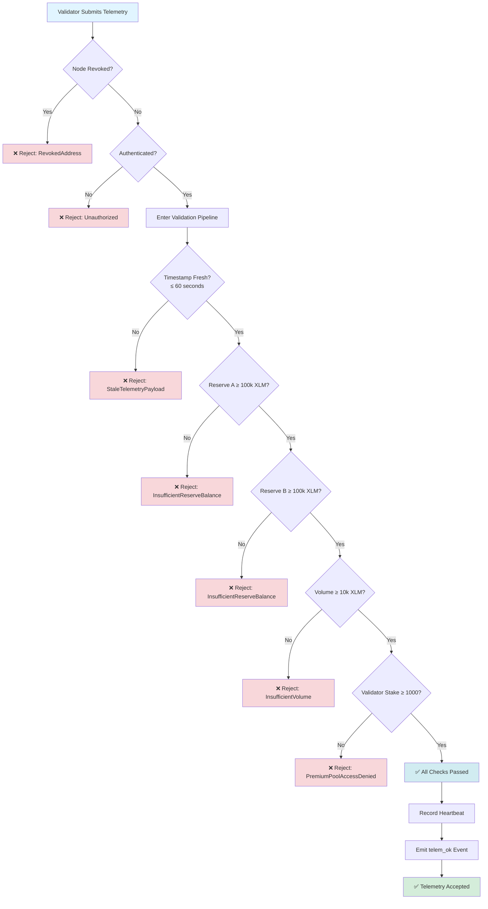
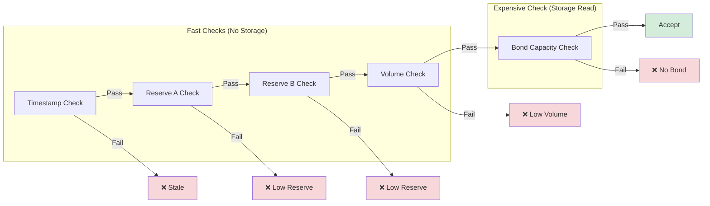
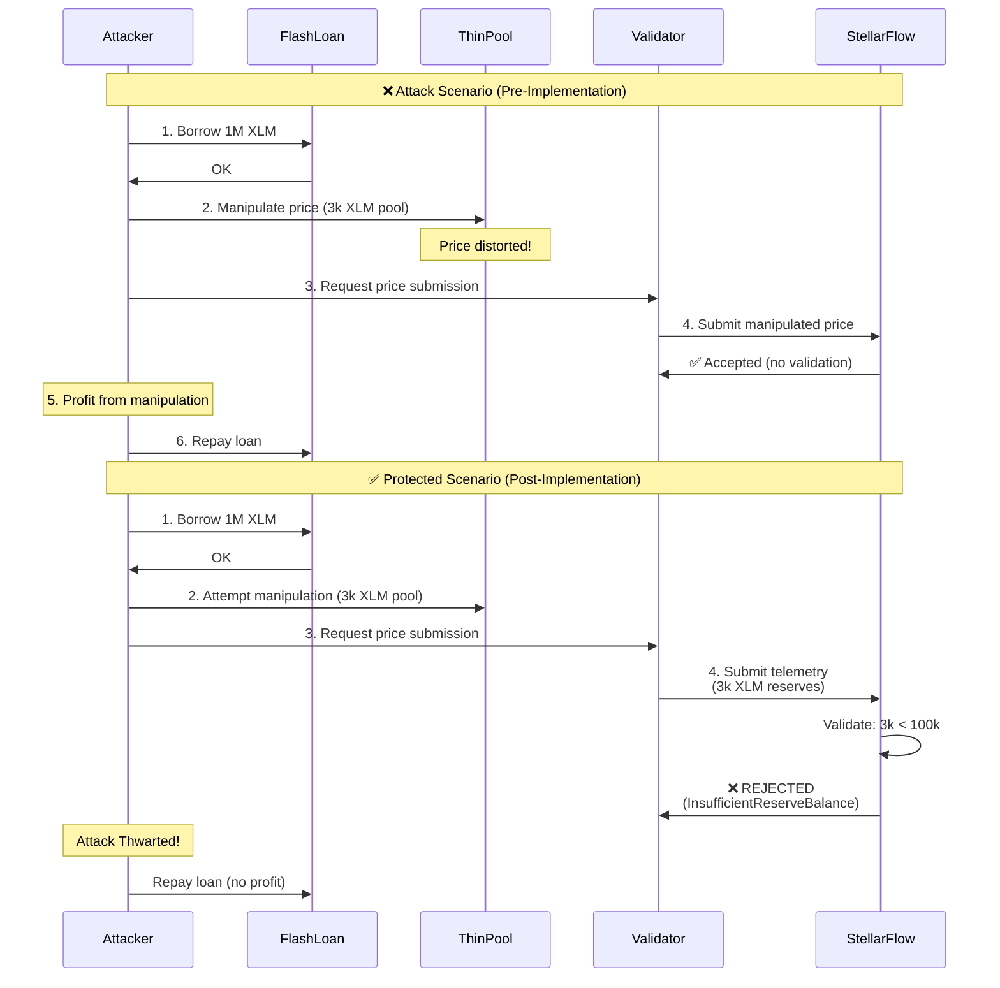
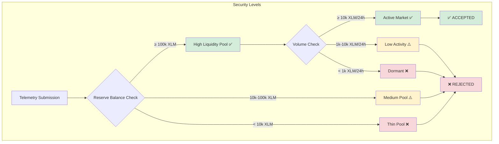
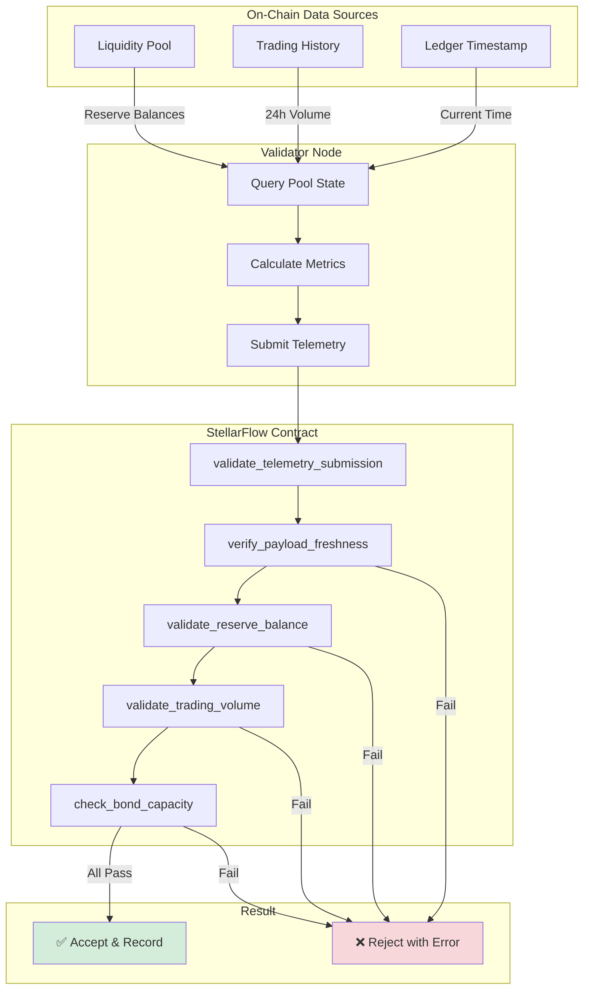
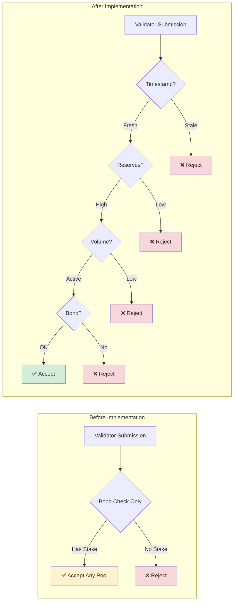
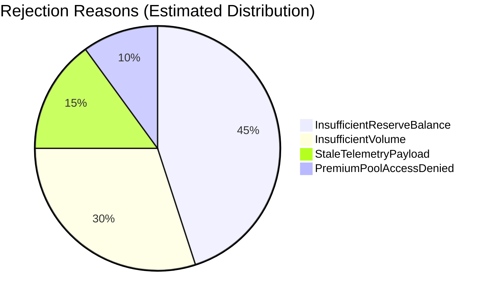
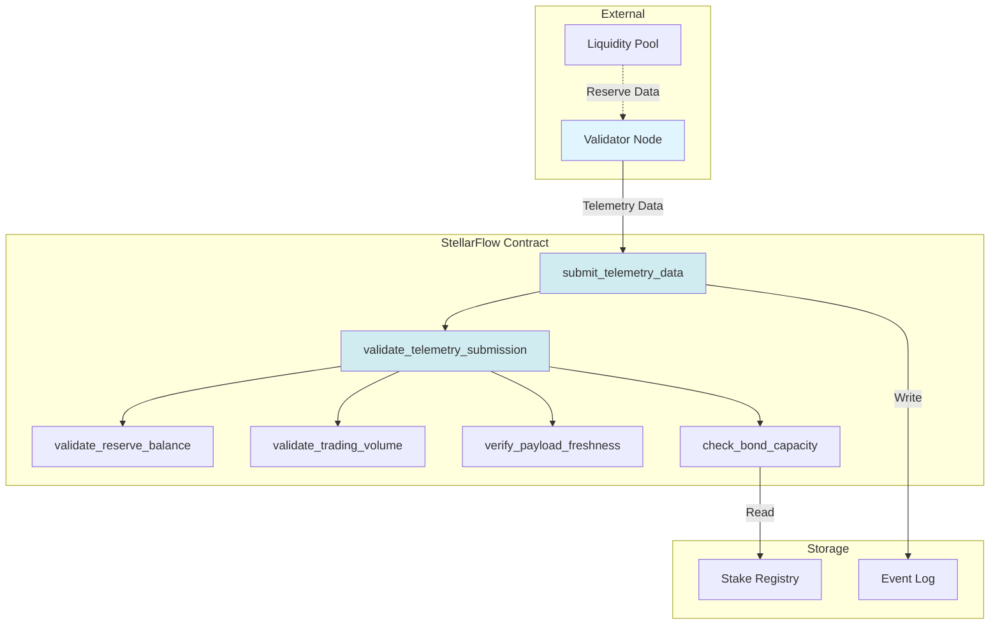
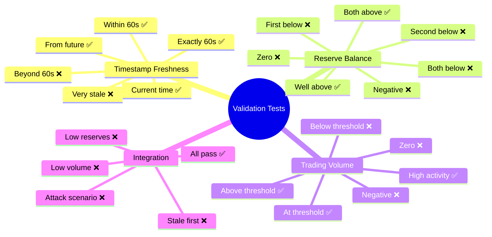

# Telemetry Validation Flow Diagram

## High-Level Architecture

## Validation Pipeline Details

## Flash Loan Attack Prevention

## Security Threshold Matrix

## Data Flow

## Comparison: Before vs After

## Error Distribution (Expected)

## Component Interaction

## Testing Coverage

---

**Legend:**
- ✅ = Test passes / Telemetry accepted
- ❌ = Test fails / Telemetry rejected
- ⚠️ = Warning / Edge case
- 🔒 = Security check
- 💾 = Storage operation
- 📊 = Monitoring/Events
